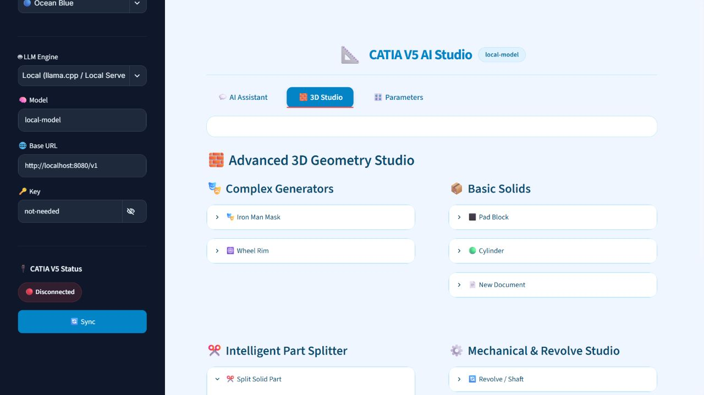
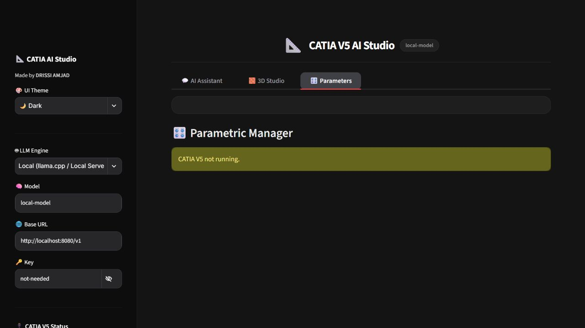

# CATIA V5 R21 AI Studio

CATIA AI Studio is a Windows desktop bridge for creating and editing CATIA V5 geometry through natural-language commands, local LLM servers, or supported cloud providers.

Created by **DRISSI AMJAD**.

## Product preview

The interface is designed as a focused engineering workspace with Light, Ocean Blue, and Dark themes.






## Features

- Native Windows desktop window through `pywebview`; no browser tab is required.
- AI Assistant for natural-language CATIA automation with local or cloud LLM providers.
- Advanced 3D Studio tools for Iron Man masks, wheel rims, pads, cylinders, revolved shafts, circular patterns, and new documents.
- Boolean-remove CAD architecture for reliable through-cuts.
- Intelligent part splitting with planar, jigsaw/puzzle, and pyramid modes.
- Parametric Manager for inspecting and updating numeric CATIA parameters.
- Three theme modes with keyboard-visible focus, readable status feedback, and reduced-motion support.

## Requirements

- Windows 10 or later.
- Python 3.10+ for development or rebuilding.
- CATIA V5 R20/R21 or a compatible V5-6 release for CATIA automation features.
- A local LLM server such as llama.cpp/Ollama, or credentials for a supported cloud provider.
- Microsoft WebView2 Runtime for the native desktop window.

## Run the packaged application

1. Start CATIA V5 if CATIA automation is required.
2. Launch `dist\\CATIA_AI_Bridge\\CATIA_AI_Bridge.exe`, or run `launch_app.bat`.
3. Select the LLM engine, model, base URL, and key in the sidebar.
4. Use **Sync** to refresh the CATIA connection status.

The packaged executable is generated at:

```text
dist\\CATIA_AI_Bridge\\CATIA_AI_Bridge.exe
```

## Development setup

```powershell
python -m venv .venv
.venv\\Scripts\\Activate.ps1
python -m pip install -r requirements.txt
python run_app.py
```

For a browser-only development session, use:

```powershell
streamlit run app.py
```

## Build the Windows executable

```powershell
python build_exe.py
```

The build uses PyInstaller in one-directory mode and keeps the runtime files beside the executable. Build output is local-only and should not be committed to Git.

## Project layout

```text
app.py             Streamlit UI, themes, LLM workflow, and CATIA actions
run_app.py         Native pywebview launcher and local Streamlit server
build_exe.py       PyInstaller build entry point
requirements.txt   Python dependencies
docs/images/       Versioned product screenshots used by this README
```

## Configuration and security

API keys are entered locally at runtime and are not required for local providers. Do not commit keys, CATIA files, personal screenshots, `.streamlit/secrets.toml`, or environment files. If a key is exposed, revoke it with its provider immediately.

## Troubleshooting

- **CATIA V5 not running:** start CATIA and press **Sync**. Some tools require an active CATPart.
- **Local model unavailable:** confirm the local server is running and that the Base URL matches its OpenAI-compatible endpoint.
- **Native window does not open:** install or repair Microsoft WebView2 Runtime, then retry `run_app.py`.
- **Build dependency errors:** activate the virtual environment and reinstall `requirements.txt` before running `build_exe.py`.

## Release checklist

Before creating a private GitHub Release:

1. Run `python -m py_compile app.py run_app.py build_exe.py`.
2. Verify Light, Ocean Blue, and Dark themes, including the password visibility control.
3. Run `python build_exe.py`.
4. Smoke-test `dist\\CATIA_AI_Bridge\\CATIA_AI_Bridge.exe`.
5. Create a version tag such as `v1.0.0` and attach the executable directory as the release artifact.

## License

This project is maintained as a private application by its author. Contact the author before redistributing the source or packaged executable.
