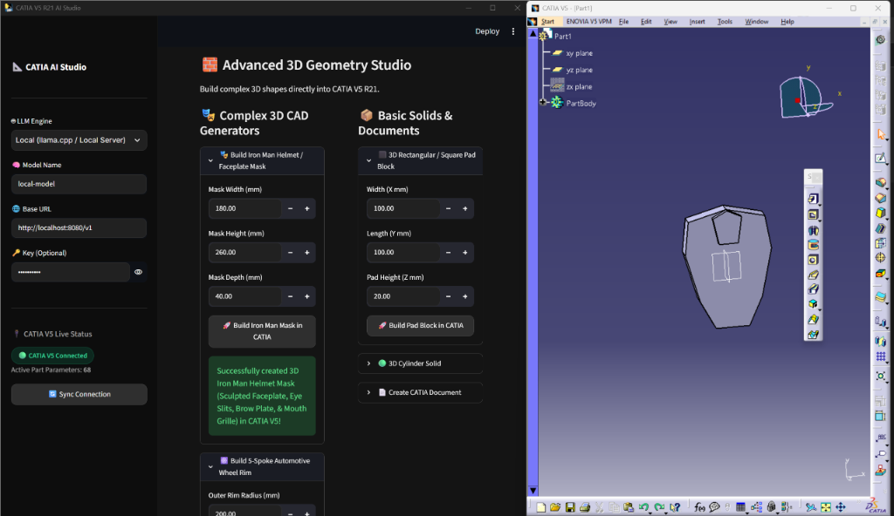
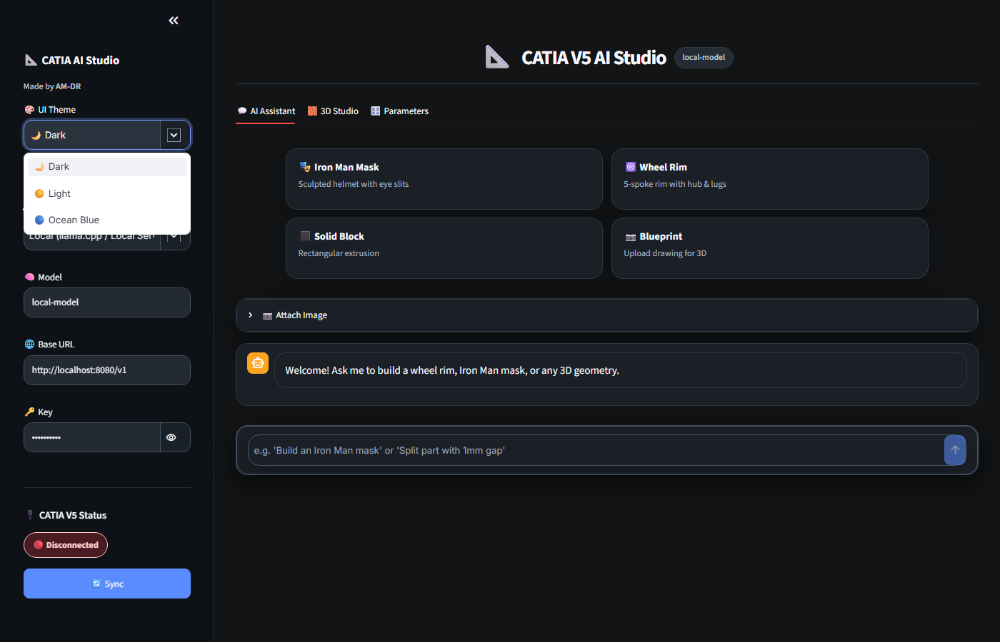
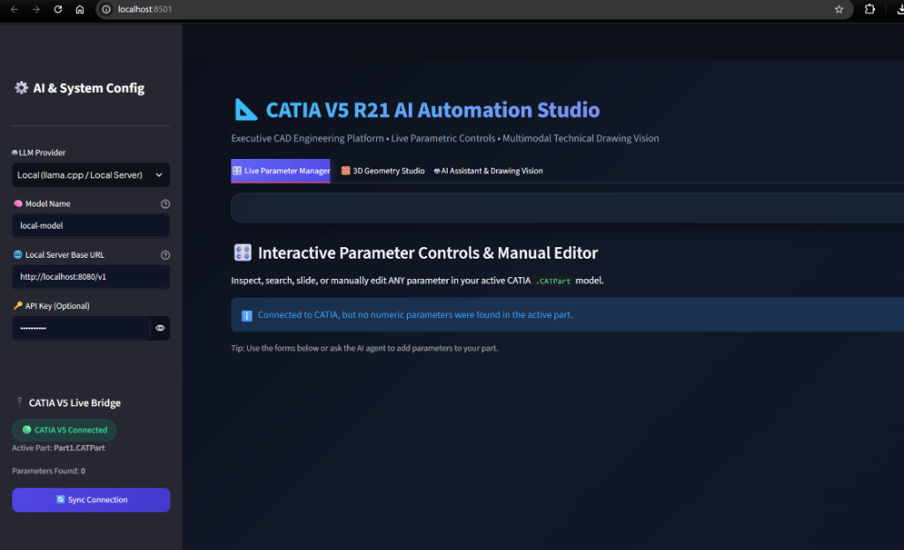
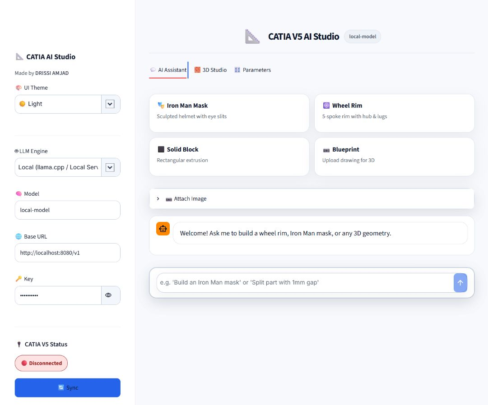

# 🚀 CATIA V5 R21 AI Studio & Bridge

<div align="center">



**An intelligent, multi-model AI assistant and CAD automation desktop platform for Dassault Systèmes CATIA V5 R21+**

*Crafted by **AM-DR***

[](https://microsoft.com/windows)
[](https://www.3ds.com/)
[](https://python.org)
[](LICENSE)

</div>

---

## 📖 Product Overview

**CATIA V5 AI Studio** bridges modern Large Language Models (LLMs) with Dassault Systèmes **CATIA V5** engineering software via Windows COM automation (`win32com` / `pycatia`). It provides mechanical engineers, industrial designers, and CAD technicians with an intuitive desktop environment to generate complex 3D parametric solids, manipulate part dimensions, execute interlocking multi-piece part splits, and run autonomous CAD coding scripts directly from natural language prompts or high-speed manual parametric controls.

---

## 📸 Visual Showcase & QA Gallery

| **3D Geometry & Part Splitting Studio** | **Interactive Parameter Manager** |
| :---: | :---: |
|  |  |

| **AI Assistant (Dark Theme)** | **AI Assistant (Light Theme)** |
| :---: | :---: |
|  |  |

---

## ✨ Key Features

### 1. 🖥️ Native Desktop Application (`pywebview`)
- Runs as a standalone Windows GUI application with zero browser tabs or popups.
- Instant process lifecycle management with automatic background Streamlit orchestration.

### 2. ✂️ Intelligent Part Splitter Suite
- **Planar Split**: Cuts parts along `PlaneXY`, `PlaneYZ`, or `PlaneZX` with custom clearance gaps (e.g. `1.0mm`).
- **Jigsaw / Puzzle Interlocking Split**: Mathematically generated dovetail puzzle teeth for rapid 3D printing and interlocking mechanical assembly without fasteners.
- **4-Quadrant Pyramid / Diagonal X-Split**: Intersecting diagonal cutter bodies dividing blocks into 4 interlocking pyramid wedges.

### 3. ⚙️ Mechanical & Revolve Studio
- **Revolve / Shaft**: Turned bushing and cylinder generator with explicit 2D CenterLine axis control.
- **Radial Circular Patterns**: Parametric multi-hole circle arrays generated directly in 2D sketches.
- **Complex Generators**: Parametric 3D Iron Man Helmet Faceplate Mask, 5-Spoke Automotive Wheel Rim, Pad blocks, and Cylinders.

### 4. 🤖 Multi-LLM AI Coding Agent & Live Diagnostics
- Supports **Local Offline Models** (`llama.cpp`, `Ollama`, LM Studio) and **Cloud Providers** (**Google Gemini**, `OpenAI`, `Anthropic Claude`, `OpenRouter`, `DeepSeek`).
- **Live Code Inspector**: View generated Python scripts, syntax validation, and real-time CATIA COM execution logs.
- Multimodal technical drawing vision support (upload blueprints, sketches, or 2D diagrams to convert into 3D CAD).

### 5. 🎨 Multi-Theme System
- **🌙 Dark Theme**: High-contrast dark grey/black palette for reduced eye strain during extended CAD sessions.
- **☀️ Light Theme**: Crisp clean white and subtle grey interface matching standard Windows engineering suites.
- **🔵 Ocean Blue Theme**: Modern deep navy and cyan-accented palette.

---

## 🛠️ Prerequisites

1. **Operating System**: Windows 10 or Windows 11 (64-bit).
2. **CAD Software**: Dassault Systèmes CATIA V5 (R20, R21, or V5-6R202X) installed and running.
3. **Python Runtime** (for development / rebuilding): Python 3.10 or 3.11 (64-bit) with `pip`.
4. **LLM Endpoint**:
   - *Local*: `llama.cpp`, `Ollama` (`http://localhost:11434/v1`), or LM Studio (`http://localhost:1234/v1`).
   - *Cloud*: Google Gemini API Key, OpenAI API Key, Anthropic API Key, or OpenRouter API Key.

---

## 🚀 Quick Start & Usage

### Running the Standalone Executable (No Python Required)
1. Ensure **CATIA V5** is running with an active Part (`.CATPart`).
2. Double-click **`launch_app.bat`** (or open `dist\CATIA_AI_Bridge\CATIA_AI_Bridge.exe`).
3. The desktop studio will open automatically and connect to CATIA V5.

### Running from Source in Development
```bash
# 1. Clone the repository
git clone https://github.com/AM-DR/Catia-AI-bridge.git
cd Catia-AI-bridge

# 2. Install dependencies
pip install -r requirements.txt

# 3. Launch application window
python run_app.py
```

---

## 🔨 Rebuilding the Standalone Binary

To recompile the lightweight standalone distribution package after making code changes:

```bash
# Rebuild the standalone executable with PyInstaller
python build_exe.py
```
The compiled output is placed in `dist\CATIA_AI_Bridge\CATIA_AI_Bridge.exe`.

---

## 📂 Project Structure

```text
Catia-AI-bridge/
├── .gitignore              # Git ignore configuration
├── README.md               # Product documentation & user guide
├── requirements.txt        # Python package dependencies
├── app.py                  # Core Streamlit CAD Studio application logic
├── run_app.py              # Standalone pywebview desktop launcher
├── build_exe.py            # Lightweight PyInstaller automated build script
├── launch_app.bat          # 1-Click batch launcher for end users
└── docs/
    └── images/             # Visual QA screenshots & gallery
        ├── desktop_window.png
        ├── parameters.png
        ├── ocean_blue_studio.png
        ├── dark_assistant.png
        └── light_assistant.png
```

---

## 🔒 Security Guidance for API Keys

- **Local Storage**: API Keys entered in the sidebar are stored exclusively in temporary session memory (`st.session_state`) during execution.
- **Never Committed**: Keys are never written to disk, cache files, or git commits.
- **Local Model Privacy**: When using Local Providers (`llama.cpp` / `Ollama`), all prompts and CAD models remain 100% offline on your local machine with zero external network traffic.

---

## 🩺 Troubleshooting & Diagnostics

| Issue | Cause | Solution |
| :--- | :--- | :--- |
| `CATIA V5 Disconnected` | CATIA V5 is closed or not registered in COM table. | Start CATIA V5, open a new `.CATPart`, and click **Sync Connection**. |
| `The method Update failed` | Clashing overlapping bodies or unmaterialized cutter limits. | Ensure cutter bodies are updated prior to Boolean Remove; use the built-in Part Splitter or Revolve tools. |
| `Port 8501 already in use` | Previous instance worker process still lingering in background. | Close all running instances or run `taskkill /F /IM python.exe` in PowerShell. |

---

## 👨‍💻 Author & Attribution

Developed and maintained by **AM-DR**.  
Contributions, feedback, and feature requests are welcome via [GitHub Issues](https://github.com/AM-DR/Catia-AI-bridge/issues).

---

## 📄 License

This project is licensed under the MIT License - see the [LICENSE](LICENSE) file for details.

